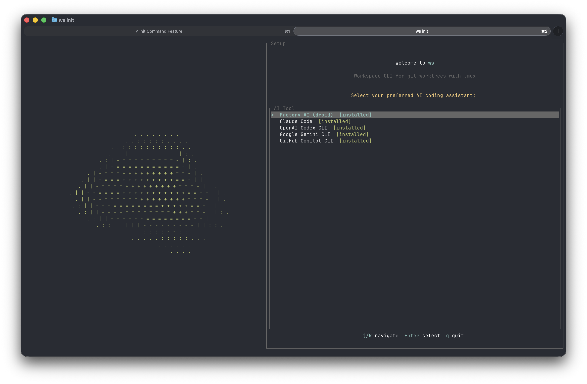
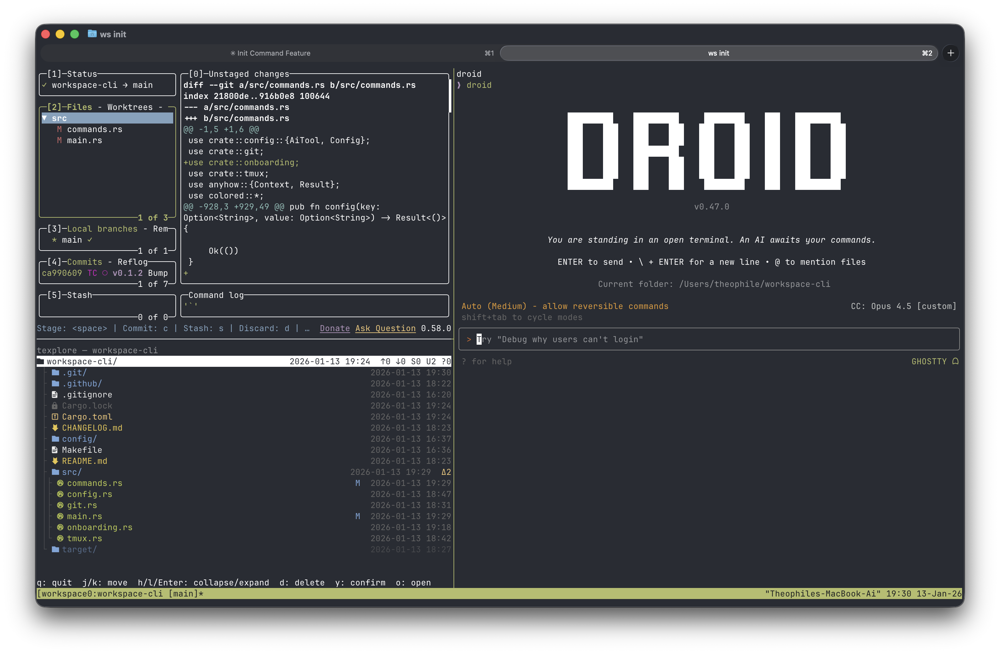

# ws - Workspace CLI

A CLI tool for managing git worktrees with tmux layouts. Each worktree gets its own tmux session with a pre-configured layout (lazygit, file explorer, Claude Code).





## Installation

### From GitHub Releases (Recommended)

```bash
# macOS Apple Silicon
curl -L https://github.com/0xthc/workspace-cli/releases/latest/download/ws-macos-aarch64.tar.gz | tar xz
mv ws ~/bin/

# macOS Intel
curl -L https://github.com/0xthc/workspace-cli/releases/latest/download/ws-macos-x86_64.tar.gz | tar xz
mv ws ~/bin/

# Linux x86_64
curl -L https://github.com/0xthc/workspace-cli/releases/latest/download/ws-linux-x86_64.tar.gz | tar xz
mv ws ~/bin/
```

### From Source

```bash
# Clone and install with dependencies
git clone https://github.com/0xthc/workspace-cli.git
cd workspace-cli
make install

# Or install just the binary
make install-bin

# Check dependencies
ws doctor

# Install missing dependencies
ws doctor --install
```

## Usage

```bash
ws                           # Open workspace for current directory
ws open feat/auth            # Open by branch name, path, or directory
ws new feat/auth             # Create worktree from develop
ws new hotfix/bug -f main    # Create worktree from main
ws list                      # List all worktrees with session status
ws select                    # Interactive worktree picker (fzf)
ws status                    # TUI dashboard of worktrees & sessions
ws delete feat/auth          # Delete worktree, session, and branch
ws reload                    # Reload current workspace session
ws reload feat/auth          # Reload specific worktree session
ws sync                      # Clean up orphaned sessions
ws sync --create             # Create sessions for worktrees without one
ws sync --delete             # Delete worktrees without active sessions
ws doctor                    # Check dependencies
ws doctor --install          # Install missing dependencies
ws config                    # Show current configuration
ws config ai_tool claude     # Set AI tool (droid, claude, codex, gemini, copilot)
ws init                      # Re-run setup wizard
ws ai                        # Switch AI tool in current session (TUI popup)
ws ai claude                 # Switch to specific AI tool directly
```

### Aliases

| Command | Aliases |
|---------|---------|
| `open`  | `o`     |
| `new`   | `n`     |
| `list`  | `l`, `ls` |
| `select`| `s`     |
| `delete`| `d`, `rm` |
| `reload`| `r`     |
| `ai`    | `a`     |

## Integrations

### tmux

Add these keybindings to `~/.tmux.conf`:

```bash
# Worktree selector popup
bind-key W display-popup -E -w 60% -h 60% "ws select"

# AI tool switcher popup
bind-key A display-popup -E -w 50% -h 50% "ws ai"

# Reload current workspace session
bind-key R run-shell "ws reload"
```

- `prefix + W` - Open worktree selector popup
- `prefix + A` - Open AI tool switcher popup
- `prefix + R` - Reload current workspace session

### lazygit

In the Worktrees panel, press `o` to open the selected worktree in a new session.

## Session Naming

Sessions are named `<repo>-<branch>`:
- `basalt-main`
- `basalt-feat-auth`
- `myproject-fix-bug-123`

## Dependencies

| Tool | Required | Description |
|------|----------|-------------|
| tmux | Yes | Terminal multiplexer |
| git  | Yes | Version control |
| fzf  | Yes | Fuzzy finder |
| lazygit | No | Git TUI |
| droid | No | Claude Code CLI |

Run `ws doctor --install` to install missing dependencies via Homebrew.
